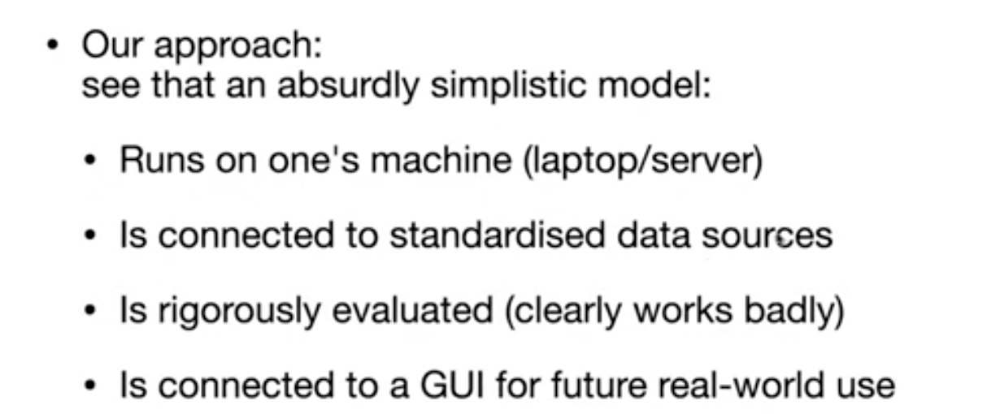
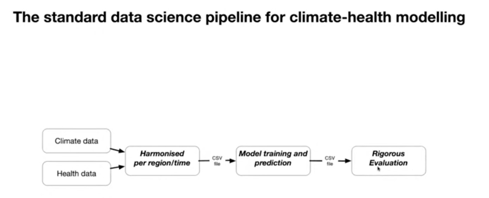

# Climate-Informed Cholera Early Warning and Decision-Support Tool
## Zimbabwe and Southern Africa

### Overview

This system provides early warning capabilities for cholera outbreaks in Zimbabwe and Southern Africa by integrating climate data, epidemiological surveillance, and advanced predictive modeling. The tool is designed to support anticipatory public health action in Zimbabwe, with the ability to scale across Southern Africa.

#### The Zimbabwe Context

In Zimbabwe, recurrent cholera outbreaks—such as those experienced in Harare's high-density suburbs (e.g., Budiriro, Glen View, Kuwadzana) and flood-prone districts along major river systems—have been closely linked to heavy rainfall, flooding, prolonged droughts, and failures in water and sanitation infrastructure. For example:

- Intense rainy seasons frequently overwhelm aging sewage systems in urban areas
- Drought conditions in rural districts force communities to rely on unsafe water sources, increasing cholera risk
- Known hotspots require targeted, climate-resilient preventive planning

The tool integrates historical cholera surveillance data, seasonal climate forecasts, and environmental indicators to identify districts at heightened risk weeks to months in advance. This allows Zimbabwe's Ministry of Health and Child Care, local authorities, and humanitarian partners to act early—before outbreaks escalate—by pre-positioning water treatment supplies, repairing sanitation infrastructure, strengthening health facility preparedness, and targeting high-risk communities with preventive interventions.

By addressing known Zimbabwean hotspots and climate-driven risk patterns, the tool directly responds to the country's repeated experience of reactive cholera response cycles, and supports a shift toward climate-resilient, preventive public health planning. Once validated in Zimbabwe, the model can be extended to neighboring countries facing similar climate and infrastructure challenges.

### System Approach



Our approach is designed to be:
- **Locally deployable**: Runs on standard computing infrastructure (laptop/server)
- **Standards-based**: Connected to standardised, publicly available data sources
- **Rigorously evaluated**: Undergoes thorough validation and performance assessment
- **User-ready**: Connected to a GUI for practical real-world deployment

### Data Science Pipeline



The system follows a standard data science pipeline for climate-health modelling:
1. **Data Integration**: Climate data and health data are collected from various sources
2. **Harmonisation**: Data is harmonised per region/time to ensure consistency
3. **Model Training and Prediction**: Machine learning models are trained and generate predictions
4. **Rigorous Evaluation**: Models undergo comprehensive evaluation to ensure reliability

### CHAP Platform Integration

This system is built on **CHAP (Climate and Health Analysis Platform)**, a Python-based framework developed by DHIS2 for climate-health modeling. CHAP provides:

- **Standardized Data Pipelines**: Automated harmonization of climate and health data per region/time
- **Model Orchestration**: Framework for training, tuning, and deploying predictive models
- **Rigorous Evaluation**: Comprehensive model validation and performance assessment
- **Hyperparameter Tuning**: Automated optimization of model parameters
- **DHIS2 Integration**: Native connection to DHIS2 health information systems
- **MLflow Integration**: Experiment tracking and model versioning

CHAP enables this cholera early warning system to leverage proven climate-health modeling patterns while maintaining compatibility with national health data systems like DHIS2.

**Learn more**: [CHAP Documentation](https://dhis2-chap.github.io/chap-core/) | [CHAP on GitHub](https://github.com/dhis2-chap/chap-core)

### Project Structure
```
CholeraEarlyWarningSystem/
├── data/                          # Data storage
│   ├── raw/                       # Raw unprocessed data
│   ├── processed/                 # Cleaned and processed data
│   ├── climate/                   # Climate and meteorological data
│   ├── epidemiological/           # Cholera case data
│   └── geospatial/               # Geographic and demographic data
├── models/                        # Machine learning models
│   ├── trained/                   # Saved trained models
│   └── evaluation/                # Model evaluation results
├── src/                           # Source code
│   ├── data_processing/           # Data ingestion and processing
│   ├── modeling/                  # Predictive models
│   ├── visualization/             # Dashboards and visualizations
│   └── api/                       # API endpoints
├── notebooks/                     # Jupyter notebooks for analysis
├── config/                        # Configuration files
├── tests/                         # Unit and integration tests
├── docs/                          # Documentation
└── outputs/                       # Generated outputs
    ├── reports/                   # Analysis reports
    ├── maps/                      # Risk maps
    └── forecasts/                 # Outbreak forecasts
```

### Core Prediction Question

**Primary Question:** Which districts in Zimbabwe are most likely to experience cholera outbreaks in the coming weeks or months due to climate and environmental conditions, and what preventive actions should be prioritized?

**Disease Area:** Cholera (waterborne infectious disease)

**Geographic Coverage:**
- **Primary:** District and provincial level in Zimbabwe
- **Secondary (scalable):** Regional and cross-border level across Southern Africa

**Intended Use:**
- Early warning of cholera outbreaks
- Targeted preparedness and prevention planning
- Efficient allocation of scarce public health and WASH resources

### Key Features
- **CHAP Integration**: Built on the Climate and Health Analysis Platform (CHAP) for standardized climate-health modeling
- Real-time climate data integration (rainfall, temperature, ENSO indices)
- Epidemiological surveillance data processing
- Predictive modeling using machine learning with CHAP's model orchestration
- Geographic risk mapping
- Early warning alerts
- Decision-support dashboards
- API for external integrations
- DHIS2 compatibility through CHAP framework

### Data Sources

The modelling tool leverages existing datasets already used in Zimbabwe and the region:

#### Health Data
- District-level cholera case and mortality data from the Ministry of Health and Child Care
- Integrated Disease Surveillance and Response (IDSR) reports
- Records from past outbreaks in urban and rural districts
- WHO AFRO regional data

#### Climate and Environmental Data
- Rainfall, temperature, and extreme weather data from the Zimbabwe Meteorological Services Department
- WMO World Weather Information Service for Zimbabwe: https://worldweather.wmo.int/en/country.html?countryCode=ZWE
- DHIS2 Climate Data App for health-climate integration: https://dhis2.org/climate/climate-data-app/
- Seasonal climate outlooks from regional climate centers (CHIRPS, ERA5, NOAA climate indices)
- Satellite-derived flood and surface water indicators
- ENSO and climate anomaly data

#### Water and Sanitation Data
- Urban sewage system status and breakdown reports (e.g., high-density suburbs in Harare)
- Rural water access and borehole functionality data
- WASH coverage indicators from national and partner surveys

#### Socio-demographic and Geospatial Data
- Zimbabwe National Geospatial and Space Agency (ZINGSA) GeoPortal: https://zimgeoportal.org.zw/
- Population density and settlement type (urban informal vs rural) from WorldPop
- Administrative boundaries from GADM and Zimbabwe GeoPortal
- Poverty and service access indicators
- Cross-border mobility data relevant to Southern Africa
- OpenStreetMap infrastructure data

### Installation

#### Prerequisites
- Python 3.8 or higher (Python 3.11 recommended for CHAP)
- pip package manager
- Git

#### Installation Steps

```bash
# Clone the repository
git clone https://github.com/Robert-Selemani/Cholera-Early-Warning-System.git
cd CholeraEarlyWarningSystem

# Create virtual environment (Python 3.11 recommended)
python3.11 -m venv venv
source venv/bin/activate  # On Windows: venv\Scripts\activate

# Upgrade pip
pip install --upgrade pip

# Install dependencies (includes CHAP platform)
pip install -r requirements.txt

# Verify CHAP installation
chap --help
```

#### Alternative: Using Conda (Recommended for CHAP)

```bash
# Create conda environment with Python 3.11
conda create -n cholera-ews python=3.11
conda activate cholera-ews

# Clone and install
git clone https://github.com/Robert-Selemani/Cholera-Early-Warning-System.git
cd CholeraEarlyWarningSystem
pip install -r requirements.txt
```

### Quick Start
```bash
# Configure the system
cp config/config.example.yaml config/config.yaml
# Edit config.yaml with your settings

# Run data processing pipeline
python src/data_processing/main.py

# Train models
python src/modeling/train.py

# Launch dashboard
python src/visualization/dashboard.py
```

### Decision-Support Framework

#### Core Policy Question
**Where and when should Zimbabwe deploy cholera prevention and preparedness measures ahead of high-risk climate periods such as the rainy season or extreme weather events?**

#### National-Level Applications
The model informs:
- Pre-rainy season activation of cholera preparedness plans
- District-level prioritization for water treatment, sanitation repairs, and health worker deployment
- Targeting of oral cholera vaccination campaigns in recurrent hotspot areas
- Longer-term investment decisions for climate-resilient water and sanitation infrastructure

#### Regional-Level Applications
At the Southern Africa level, it supports:
- Cross-border outbreak risk coordination
- Regional climate-health early warning initiatives
- Evidence-based alignment of public health, disaster risk reduction, and climate adaptation policies

### Usage
See detailed documentation in the `docs/` folder.

### Contributing
Please read CONTRIBUTING.md for details on our code of conduct and the process for submitting pull requests.

### License
[Specify License]

### Contact
[Project Team Contact Information]

### Acknowledgments
- Climate and health data providers
- Zimbabwe Ministry of Health and Child Care
- Zimbabwe Meteorological Services Department
- Regional health authorities and climate centers
- WHO AFRO
- Research and humanitarian partners